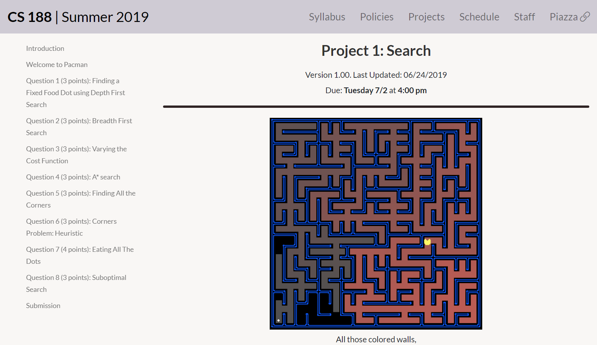
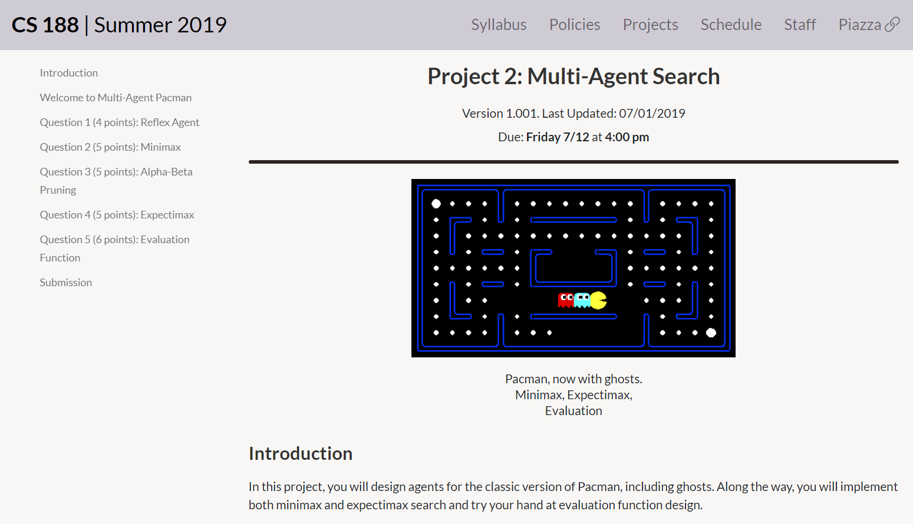
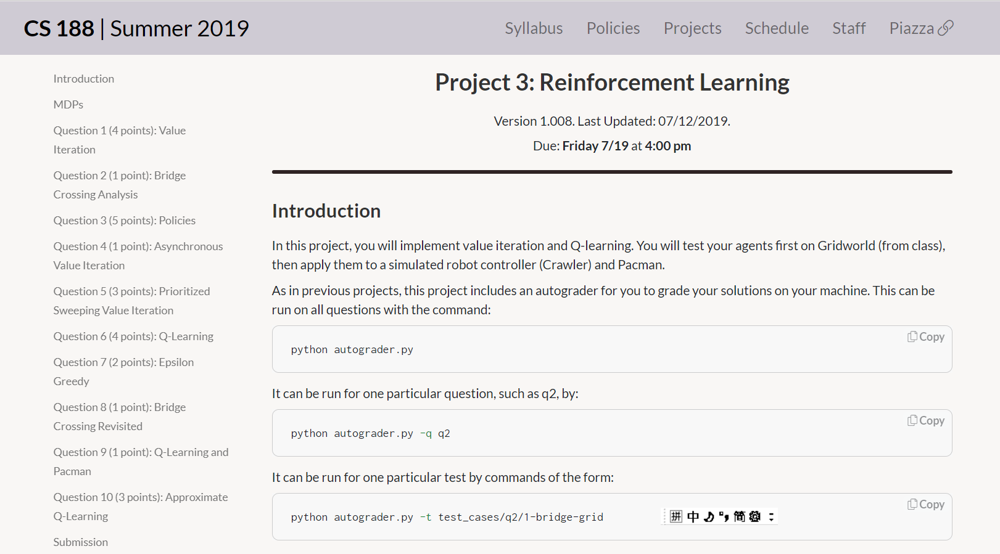
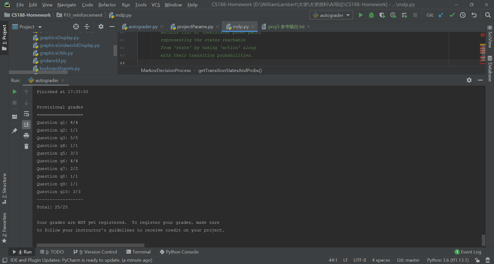
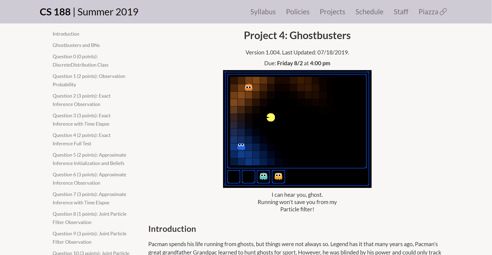
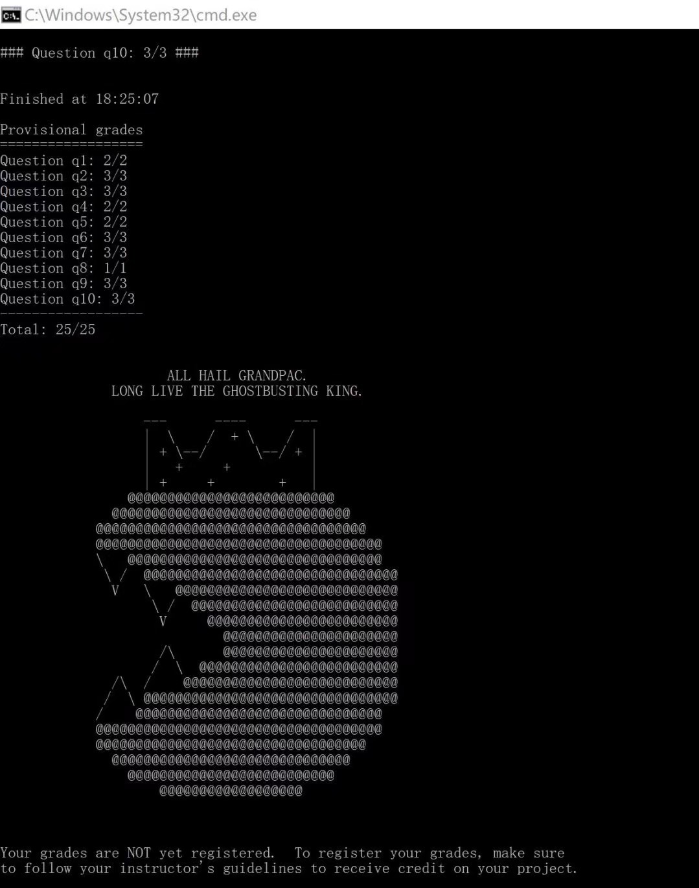
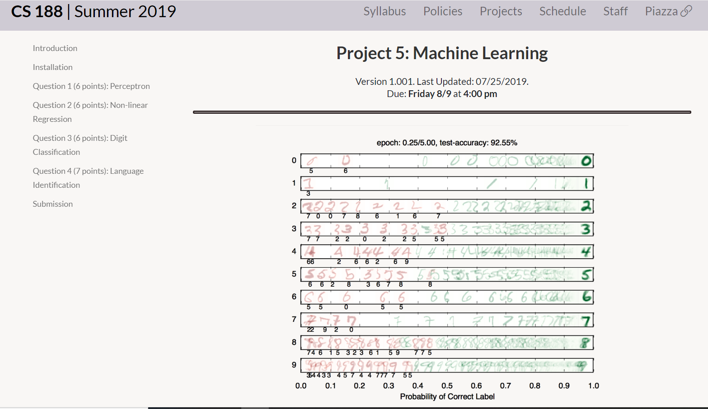

# Homework for Introduction to Artificial Intelligence, UC Berkeley CS188.  
The famous course is very helpful and important for deeper learning in AI.
CS188 2019 summer version  
Completed in 2019/06.  

## PJ1_search  

## PJ2_multiagent  

## PJ3_reinforcement  

## PJ4_Ghostbusters 

  
 

## PJ5_machinelearning  
In this Project, Q4 requires me to implement a RNN myself, using ReLu for activation, including bias in the model.  

